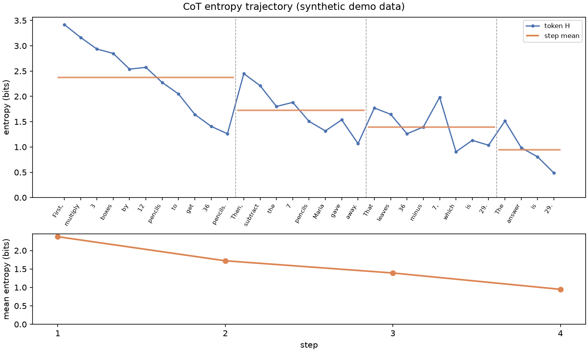

# entropy-lens

**Token-level entropy trajectories from LLM logprobs — logprobs in, entropy trajectory out.**

`entropy-lens` computes and visualizes per-token uncertainty trajectories from the
`logprobs` an LLM API already returns. No multi-sampling, no auxiliary model, no
extra forward passes — which makes it cheap enough to run on every request in a
serving pipeline.



*Demo plot generated from structured synthetic data (`python scripts/generate_demo.py`);
`scripts/verify_trajectory.py` produces the same plot from a live model.*

## Install

```bash
pip install entropy-lens            # core (numpy only)
pip install "entropy-lens[viz]"     # + matplotlib plotting
```

## Quickstart

Point any OpenAI-compatible client (vLLM, SGLang, OpenAI) at your model, ask for
logprobs, and hand the response to `entropy-lens`:

```python
from openai import OpenAI
from entropy_lens.adapters import from_openai_response
from entropy_lens.viz import plot_trajectory

client = OpenAI(base_url="http://localhost:8000/v1", api_key="EMPTY")
response = client.chat.completions.create(
    model="Qwen/Qwen2.5-0.5B-Instruct",
    messages=[{"role": "user", "content": "What is 12 * 3 - 7? Think step by step."}],
    logprobs=True,
    top_logprobs=20,
)
traj = from_openai_response(response, split="sentence")
print(traj.summary())  # mean/max/min H, per-step decrease, monotonicity
plot_trajectory(traj)  # token-level + step-level entropy plot
```

`traj` is an `EntropyTrajectory`: per-token entropies (`traj.entropies`, in bits
by default so perplexity is `2**H`), the token strings, and step boundaries with
step-level aggregates (`step_means()`, `delta_h()`, `summary()`).

## Why entropy trajectories?

A single scalar confidence hides *where* a generation was uncertain. The
trajectory view — entropy per token, aggregated per reasoning step — exposes
the structure of uncertainty during decoding:

- **Branch points**: entropy spikes mark positions where several continuations
  were genuinely plausible; in CoT answers these are the forks where reasoning
  paths diverge.
- **Convergence patterns**: in typical multi-step reasoning, per-step mean
  entropy trends downward as constraints accumulate; deviations from that
  pattern are informative.
- **Serving-friendly measurement**: because everything derives from single-pass
  logprobs, trajectories can back per-request telemetry, retrieval-stopping
  policies (e.g. expected-information-gain criteria), and reasoning-quality
  diagnostics without changing the decoding budget.

`entropy-lens` is intentionally a *measurement* layer: it is designed as the
common substrate for information-theoretic reliability tooling built on top.

## API at a glance

| Function | What it does |
| --- | --- |
| `token_entropy(logprobs, base="bits", tail="ignore")` | Shannon entropy of one position's top-k logprobs |
| `sequence_entropies(logprobs_per_token, ...)` | Per-token entropy array for a sequence |
| `perplexity_from_entropy(H)` | `2**H` — effective number of plausible next tokens |
| `split_steps(tokens, "sentence" \| "paragraph" \| "step_marker", pattern=...)` | Segment tokens into reasoning steps |
| `EntropyTrajectory` | `step_means()`, `delta_h()`, `summary()`, plotting input |
| `adapters.from_openai_response(resp)` | Parse chat & legacy completions logprobs (OpenAI/vLLM/SGLang) |
| `adapters.hf_transformers.from_hf_generate(out, tok)` | Exact full-vocab entropies from HF `generate()` scores |
| `viz.plot_trajectory(traj)` | Token-level + step-level entropy figure |

## Limitations

**Top-k logprobs give an entropy *estimate*, not the true entropy.** APIs
return only the top-k (often ≤20) logprobs per position. `tail="ignore"`
(default) renormalizes the top-k mass and in practice underestimates the true
entropy; `tail="uniform"` spreads the residual mass uniformly over the rest of
the vocabulary (`vocab_size` required) and gives an upper-bound-style estimate.
The true value lies between the two; both converge as the distribution
concentrates or k grows. The HuggingFace adapter is exempt — it sees the full
vocabulary.

**Low entropy ≠ correct.** Entropy measures the model's *confidence*, and
models can be confidently wrong (and miscalibrated, especially after RLHF-style
tuning). A falling trajectory means uncertainty collapsed, not that the answer
is right. Use `entropy-lens` as a measurement instrument, not an accuracy
judge.

**Tokenizer-dependent.** Entropies attach to tokens of the serving model;
comparing absolute values across models with different tokenizers is not
meaningful without care.

## Verification scripts

Each milestone ships a human-checkable verification script (see `scripts/`):

```bash
python scripts/verify_math.py                              # exact math sanity checks
python scripts/verify_adapter.py tests/fixtures/vllm_response.json   # token | H | ppl table
# with a live server (vllm serve Qwen/Qwen2.5-0.5B-Instruct --max-logprobs 20):
python scripts/verify_live.py --base-url http://localhost:8000/v1        # low- vs high-H contrast
python scripts/verify_trajectory.py --base-url http://localhost:8000/v1  # CoT plot -> verify_output/
```

`verify_live.py` also works against the OpenAI API (`--base-url
https://api.openai.com/v1 --api-key ... --model gpt-4o-mini`) if you have no GPU.

## Examples

- [`examples/01_basic_trajectory.ipynb`](examples/01_basic_trajectory.ipynb) — fixture response → per-token entropy table and plot
- [`examples/02_cot_step_entropy.ipynb`](examples/02_cot_step_entropy.ipynb) — CoT step segmentation, ΔH, step-level trajectory

## License

MIT
